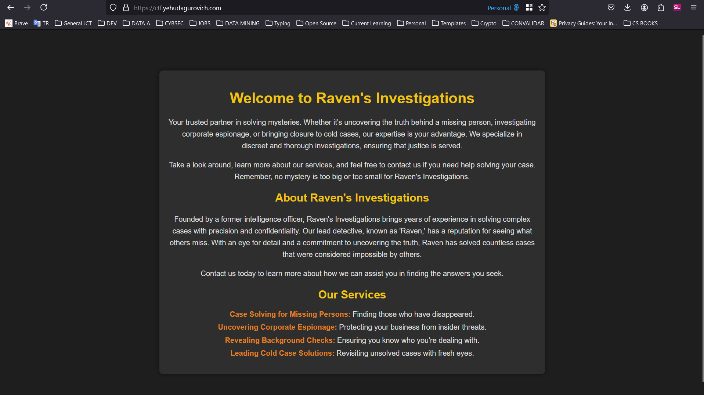
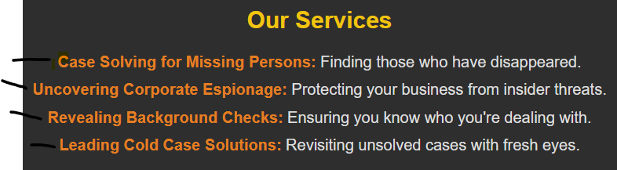
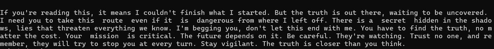
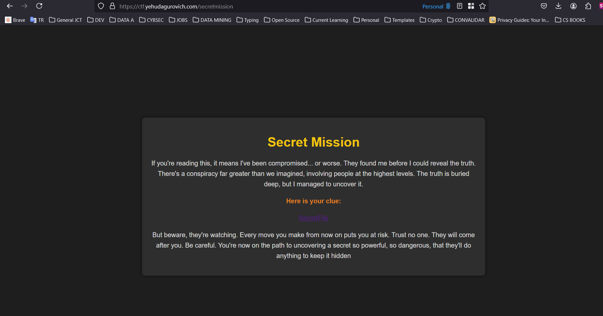
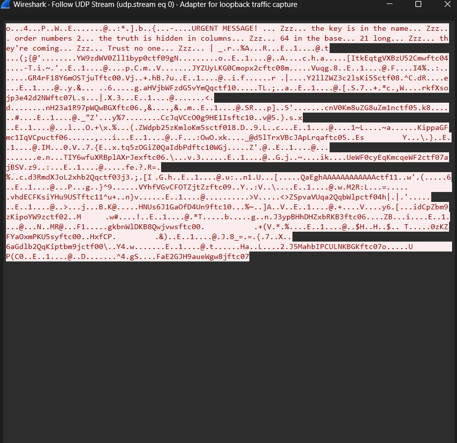
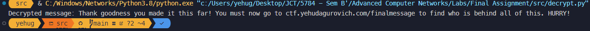
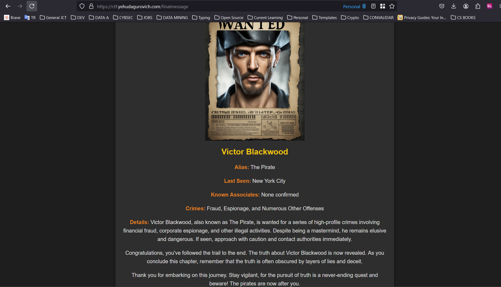

# CTF Challenge Solution Guide

**_Created by Yehuda Gurovich_**

## Table of Contents

- [CTF Challenge Solution Guide](#ctf-challenge-solution-guide)
  - [Table of Contents](#table-of-contents)
  - [Introduction](#introduction)
  - [Stage 1: Setup \& Start](#stage-1-setup--start)
    - [Step-by-Step Solution](#step-by-step-solution)
    - [Tools Used](#tools-used)
  - [Stage 2: Finding the Secret Route](#stage-2-finding-the-secret-route)
    - [Step-by-Step Solution](#step-by-step-solution-1)
    - [Tools Used](#tools-used-1)
  - [Stage 3: Executing the File \& MITM Attack](#stage-3-executing-the-file--mitm-attack)
    - [Step-by-Step Solution](#step-by-step-solution-2)
    - [Tools Used](#tools-used-2)
  - [Stage 4: Result](#stage-4-result)
    - [Step-by-Step Solution](#step-by-step-solution-3)
  - [Conclusion](#conclusion)

## Introduction

In this guide, we will walk through the solutions for each challenge in the CTF event. Each section will include a detailed explanation of the steps taken, screenshots illustrating progress, and any tools used. By following these steps, you should be able to solve the challenges and capture the flags.

## Stage 1: Setup & Start

### Step-by-Step Solution

1. **Go to the website**

   Start by going to [ctf.yehudagurovich.com](http://ctf.yehudagurovich.com) to access the initial page of the CTF.

   

### Tools Used

- Python
- HTTP server
- Google Cloud Platform
- Sockets
- Docker
- Self-hosted websites and domains

## Stage 2: Finding the Secret Route

### Step-by-Step Solution

1. **Identify the clue for CURL**

   Examine the "Our Services" section on the homepage. Note that each line starts with a capital letter. Combine these letters to form the word "CURL." As can be seen in the screenshot below, the first letter of each line spells out "CURL."

   

2. **Inspecting the Website using CURL**

   Run the `curl` command on the website to reveal a hidden message. The command would be `curl http://ctf.yehudagurovich.com`. The message will show the following hidden message in the end:

   

   Be careful to make sure that the command is run correctly to reveal the hidden message. For example, powershell doesn't support the same curl as the command line, where the correct curl is.

3. **Finding Second Hidden Message**

   In the message we obtained, we can see that some words have 2 spaces between them. By combining these words, we get the message: "route is secret mission." This indicates the secret route: [ctf.yehudagurovich.com/secretmessage](http://ctf.yehudagurovich.com/secretmeission).

4. **Go to secretmission route**

   Go to the secret mission route to download the necessary executable file.

   

### Tools Used

- Curl
- Analyzing HTTP user agents and headers

## Stage 3: Executing the File & MITM Attack

### Step-by-Step Solution

1. **Open Wireshark on loopback mode**

   Open Wireshark and start capturing packets on the loopback interface. This will allow you to monitor the network traffic on your local machine.

2. **Execute the `packets.exe` file**

   Execute the downloaded `packets.exe` file and monitor the network traffic to observe packet transmissions.

3. **Compile the Message**

   Following the UDP stream for the packets in Wireshark, you can extract the transmitted message. The message is encrypted and requires further analysis.

   The screenshot below shows the encrypted message extracted from the network traffic:
   

4. **Noticing clues and filtering useful data**

   On the first part of the message there are clues we need to set up the decryption of the message. We have _key is in the name_ meaning **RAVEN**, _the truth is hidden in columns_ meaning **Columnar Transposition Cipher**, _64 in the base_ meaning **base64 encoding**, _order number 2_ meaning the packets will be sorted by the last 2 digits of the packet message, and _21 long_ meaning the message is 21 characters long.

   One also has to notice that some messages have a `ctfXX` at the end, where `XX` is the order of the packet. These are the packets that need to be used to decrypt the message. and only the last 21 characters of the message are needed, to remove the header.

   All this should be programmed in python, but a sample of how it would look like is here:

   ```python
   def reorganize_packets(packets: str, split_length: int) -> str:
   	"""
   	Reorganize the packets to extract the hidden message. Make sure packets is formatted correctly.
   	"""
   	packets = packets.split('.')
   	# Extract the packets that contain "ctf"
   	packets = [re.sub(r'(ctf\d{2}).*', r'\1', packet)
   			for packet in packets if 'ctf' in packet]
   	# Obtain the last split_length characters of each packet
   	packets = [packet[-split_length:] for packet in packets]
   	# Sort the packets by the integer value of the last two characters
   	packets = sorted(packets, key=lambda packet: int(packet[-2:]))
   	hidden_message = ''.join(packet[:-5] for packet in packets)
   	return b64decode(hidden_message).decode().rstrip('\x00')
   ```

5. **Decrypting the Message**

   Use Python to decrypt the message using the Columnar Transposition Cipher. The decrypted message will reveal the final message.
   All this should be programmed in python, but a sample of how it would look like is here:

   ```python
   def decrypt_column_cipher(key: str, encrypted_message: str) -> str:
   	"""
   	Decrypt a message that was encrypted using the columnar cipher.
   	"""
   	# Calculate the number of rows
   	key_length = len(key)
   	message_length = len(encrypted_message)
   	num_rows = (message_length + key_length - 1) // key_length

   	# Create sorted column indices (same as in encryption)
   	column_indices = sorted(range(key_length), key=lambda k: key[k])

   	# Create empty matrix
   	matrix = [[''] * key_length for _ in range(num_rows)]

   	# Fill the matrix column by column
   	char_index = 0
   	for col in column_indices:
   		for row in range(num_rows):
   			matrix[row][col] = encrypted_message[char_index]
   			char_index += 1

   	# Read the matrix row by row
   	decrypted_message = ''.join(''.join(row) for row in matrix)

   	# Remove padding
   	return decrypted_message.rstrip('*').replace('*', ' ')
   ```

   The final decrypted message would look like this:
   

### Tools Used

- MITM attacks
- Wireshark
- Python programming
- Cryptography
- Base64 encoding
- Executable files

## Stage 4: Result

### Step-by-Step Solution

1. **Go to the final website**

   Visit [ctf.yehudagurovich.com/finalmessage](http://ctf.yehudagurovich.com/finalmessage) to access the final message where you find out who is behind the conspiracy.

   

## Conclusion

This guide provided a detailed walkthrough of the solutions for the CTF Stages. By following these steps and using the mentioned tools, you can solve the challenges and capture the flags successfully.
